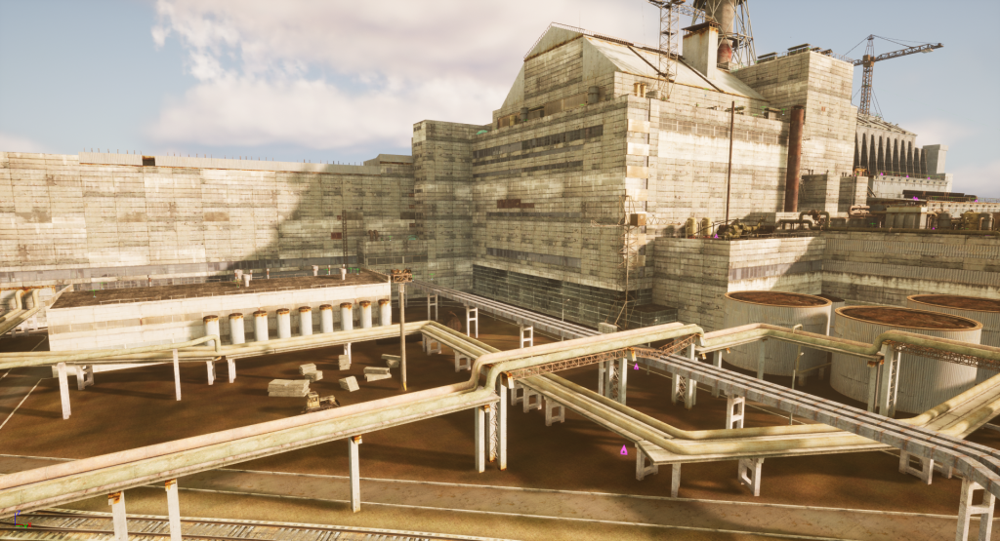

Stalker2UE 
==========================
A non-commercial project aiming to port the original S.T.A.LK.E.R. game series to Unreal Engine 5 with the intention of being mod-friendly and allowing to port existing mods to a modern engine.

Supported games
--------

|Call of Pripyat|Clear Sky|Shadow of Chernobyl|
|---|---|---|
|Beta|Beta|Yes|

How to Build
--------
1. Clone the repository with --recursive parameter

	|git clone https://github.com/RedPandaProjects/Stalker2UE --recursive|
	|---|

	

2. Build the Xray Engine source code

	|The project for Visual Studio can be found under %Project Folder%\Source\XRayEngine\Source\Engine.sln|
	|---|
	
	

	* Open it and build the desired configuration. For more details, see ["Corresponding the UnrealEngine configuration for XRayEngine" in discord server](https://discord.gg/naeer3KWFS) 
	* For example: to configure the "DebugGame" editor in the UE project, the entire solution including the Debug configuration must be built, as shown in the corresponding table.

3. After XRayEngine is built, build the UE project

	1.	Generate a project for Visual Studio
	

	2.	Open "Stalker.sln"

	3. Set the desired configuration
	

	4. Build the "Stalker" project file
	
	
	* P.S. After building the editor, you may start it, but you can not play until you install the full content.
	You may find the current content build at [last_build in discord server](https://discord.gg/qMmGqdrqpn)

	* If you'd like to import content from the gamedata yourself, see  ["Importing content from game data and rawdata" in discord server](https://discord.gg/naeer3KWFS) 

Documentation:
--------
Make sure to visit our [help in discord server](https://discord.gg/naeer3KWFS).

More details
--------
It is a place to share ideas on what to implement, gather people that want to work on the engine,
and work on the source code.

If you find a bug or have an enhancement request, file an [Issue](https://github.com/RedPandaProjects/Stalker2UE/issues).

Pull requests appreciated! However, the following things should be taken into consideration:
* Major changes should be discussed before implementation

Be advised that this project is not sanctioned by GSC Game World in any way – and they remain the copyright holders
of all the original source code.
