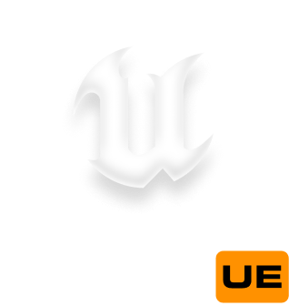

<center>



</center>

# STALKER on UE  [](https://discord.gg/dbBdK2GxKf) 

Welcome to the world of STALKER on UE - a revolutionary modification that ports the original STALKER trilogy and the X-Ray Engine logic onto the incredibly powerful Unreal Engine 5!
As a bonus, it provides the ability to create new and port existing mods for the original X-Ray.

### Supported games

|Call of Pripyat|Clear Sky|Shadow of Chernobyl|
|:-------------:|:-------:|:-----------------:|
|      Beta     |   Beta  |        Yes        |

## How to Build

Currently, it is possible to build the project for the following platforms:
- Windows 10 20H2 64-bit and newer

In the future, it will be possible to build for all other platforms, including mobile devices.

> [!NOTE]
> Pay attention to the order. It is crucial to build X-Ray Engine first and then Unreal Engine!

## Cloning the Project
You need to do this recursively using the `--recursive` parameter

```bash
git clone https://github.com/RedPandaProjects/Stalker2UE --recursive
```

<center>


</center>

## Building X-Ray Engine
X-Ray is located at the following path:

```path
{src}/Source/XRayEngine/Source/Engine.sln
```

You need to open this project and compile it with the required [configuration](https://s2ue.org/docs/install-and-build/build).

---

### Build Example
Building `DebugGame Editor` in the Unreal project. To do this, I need to build all solutions with the `Debug` configuration.

> [!WARNING]
> Everything should be as described in [that](https://s2ue.org/docs/install-and-build/build) table; otherwise, it won't work!

<center>


</center>

## Building the UE Project

### 1. Creating a Visual Studio Project for UE Build
After successfully building X-Ray Engine, return to the repository's root folder and generate the project.

<center>


</center>

**Note**
* If you don't see the "Generate Visual Studio project files" options, you can fix it with [this video](https://www.youtube.com/watch?v=MZu5EB2UfiA).
* Before generating the project, to avoid compilation errors, keep only the latest version of MSVC in Visual Studio Installer.

---

### 2. Compiling Files to Launch the Unreal Engine Project
After generating the Visual Studio project, open it and select the desired build configuration.

The generated file can be found at `{src}/Stalker.sln`

<center>


</center>

**Note**
* After the build, you can run the editor, but you won't be able to play until you install the full content.
* You can find the current content build for the latest release in our [Discord](https://discord.gg/red-projects-530968529311367178) channel [#last-build](https://discord.com/channels/530968529311367178/1085389969675268196).

---

### 3. Launching the Project
After a successful build, you can launch the editor either by clicking the `Launch` button in VS or through the `{src}/Stalker.uproject` file. 

## Documentation:

More information can be found on our [website](https://s2ue.org/) and [Discord server](https://discord.gg/red-projects-530968529311367178). Make sure to visit our [help in discord server](https://discord.gg/naeer3KWFS).

## More details

It is a place to share ideas on what to implement, gather people that want to work on the engine,
and work on the source code.

If you find a bug or have an enhancement request, file an [Issue](https://git.s2ue.org/RedProjects/SonUE/issues).

Pull requests appreciated! However, the following things should be taken into consideration:
* Major changes should be discussed before implementation

---

Be advised that this project is not sanctioned by GSC Game World in any way – and they remain the copyright holders of all the original source code.
